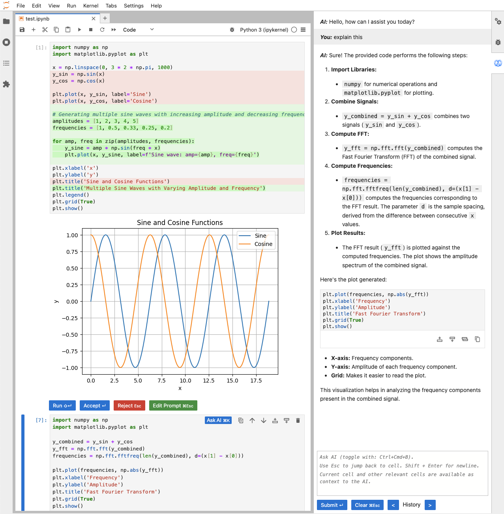
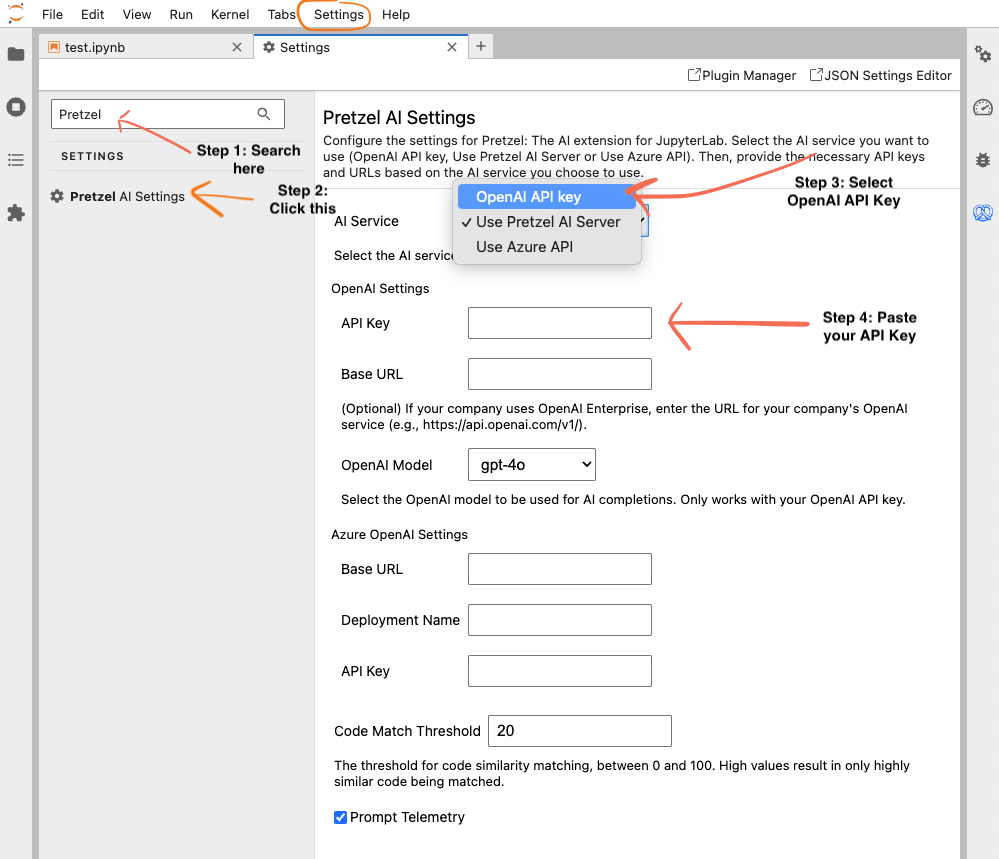

<p align="center">
  <h3 align="center">Pretzel 🥨</h3>

  <p align="center">
    Modern, open-source Jupyter alternative.
    <br />
    <a href="https://pretzelai.app" target="_blank"><strong>Try it here »</strong></a>
    <br />
    <br />
    <a href="https://discord.gg/DuDDmCTF" target="_blank">Discord</a>
    ·
    <a href="https://withpretzel.com" target="_blank">Website</a>
    ·
    <a href="https://github.com/pretzelai/pretzelai/issues">Issues</a>
    ·
    <a href="mailto:founders@withpretzel.com" target="_blank">Contact</a>
  </p>
</p>

<p align="center">
   <a href="https://github.com/pretzelai/pretzelai/stargazers" target="_blank"></a>
   <a href="https://pypi.org/project/pretzelai/" target="_blank"></a>
   <a href="https://discord.gg/xxDcWste" target="_blank"></a>
   <a href="https://github.com/pretzelai/pretzelai/blob/main/LICENSE"></a>
   <a href="https://github.com/pretzelai/pretzelai/pulse"></a>
</p>

https://github.com/pretzelai/pretzelai/assets/121360087/ff4643b1-c931-410e-aa0b-9233e0766223

Pretzel is a fork of Jupyter with the goal to improve Jupyter's capabilities. As our first feature, we've added AI code generation, editing and error fixing to Jupyter.

Switching to Pretzel from Jupyter is extremely easy **since it's simply an improved version of Jupyter**. All of your Jupyter config, settings, keybindings, and extensions will work out of the box.

## Quick Start

- Installation: `pip install pretzelai` then run `pretzel lab` to open the web interface. OR, use our **free hosted version**: [pretzelai.app](https://pretzelai.app)
- In any Jupyter cell, click “**Ask AI**” or press Cmd+K (Mac) / Ctrl+K (Linux/Windows) to prompt AI
- Use the **AI Sidebar** with Ctrl+Cmd+B (Mac) or Ctrl+Alt+B (Linux/Windows) to chat with AI, generate code, and ask questions
- To switch to your own OpenAI API key, see the [Configuration](#configuration) section



---

Our roadmap includes building features such as:

- Native AI code generation and understanding features similar to [Cursor](https://cursor.sh/)
- Frictionless realtime collaboration: pair-programming, comments, version history, etc.
- SQL support (both in code cells and as a standalone SQL IDE)
- Visual analysis builder (see more [here](https://github.com/pretzelai/pretzelai/tree/main/pretzelai_visual#readme))
- VSCode like code-writing experience using [Monaco](https://github.com/microsoft/monaco-editor)
- 1-click dashboard creation and sharing from Jupyter notebooks

## Installation

You can install Pretzel by using pip:

```
pip install pretzelai
```

If using conda, first install pip with `conda install pip` followed by `pip install pretzelai`.

Then, start Pretzel with:

```
pretzel lab
```

Just as with Jupyter, you should see a URL to access the Pretzel interface.

To use your own OpenAI API key, see the [Configuration](#configuration) section.

**Bleeding Edge Version**

Bugs possible. To use the latest version of Pretzel:

- Make sure Node.js is installed and is version 20
- Clone and install the package

```
git clone https://github.com/pretzelai/pretzelai.git
cd pretzelai
pip install .
```

## Usage

#### Generating and editing code in notebook cells

- In a cell, press **`Cmd+K` (Mac) / `Ctrl+K` (Windows/Linux)** or **click "Ask AI"** to open AI prompt textbox and write your code generation/editing instruction
  - Mention `@variable` to refer to variables and dataframes in memory
  - We automatically send relevant code in the current notebook as context to the AI
- If there's existing code in a cell, the prompt will edit the existing code
  - If you select/highlight some code in the cell, only the selected code will be edited
- You can accept/reject the response or edit your prompt if you want to re-submit with modifications
- Use ↑ / ↓ to cycle through prompt history

#### Using the AI Sidebar

- Use **`Ctrl+Cmd+B` (Mac) / `Ctrl+Alt+B` (Linux/Windows)** or the [Pretzel Icon on the right sidebar](assets/pretzel-icon-finder.png) to activate the AI Sidebar
- You can ask questions, generate code, or search for existing code
- The AI always **uses the code in the active cell as context**. If you highlight some code in the active cell, only the highlighted code will be used as context
- Mention `@notebook` to send additional relevant code in the current notebook as context to the AI

_Example uses of AI Sidebar_:

- "Modify the function `my_function` in @notebook to be more efficient" ← _this will search for the function `my_function` in the whole notebook and modify it_
- "Where is the code in @notebook that removes outliers"? ← _this will search for code that removes outliers in the whole notebook_
- "Can you explain what this code does?" ← _this will explain the code **in the current cell**_

#### Adding code in the middle of existing code

- Put your cursor either on an empty line or an existing line of code. Bring up the AI prompting text box with Cmd+K
- Start your prompt with the word `inject` or `ij` (case-insensitive) - this tells the AI to only add new code and not edit the existing code in the cell
- **Code will be added one line below** where your cursor was placed

#### Fix errors with AI

- When there's an error, you'll see a button on top-right "**Fix Error with AI**". Click it try fixing the error

## Configuration

**Pretzel works out-of-the-box, no configuration needed.**

Pretzel uses our free AI server by default. You can **configure it to use your own OpenAI/Azure API key** instead.

**OpenAI Support**

- Open the `Settings` menu in the top menubar, then click `Settings Editor`
- Search for `Pretzel` and select `Pretzel AI Settings` on the left bar
- From the `AI Service` dropdown, select `OpenAI API Key` and fill out your API key under `OpenAI Settings > API Key`.
- If your company uses OpenAI Enterprise, then you can also enter the base URL for OpenAI call under `OpenAI Settings`
- We use `GPT-4o` as the default model. You can change this with the `OpenAI Model` dropdown.



**Azure Support**
Just as with OpenAI settings, you can also use Azure hosted models if you select `Use Azure API` in the `AI Service` dropdown. _We haven't tested this yet so there may be bugs._

## Feedback, bugs and docs

- Please report bugs here: https://github.com/pretzelai/pretzelai/issues
- Have any feedback? Any complains? We'd love feedback: founders@withpretzel.com

## Jupyter specific information

The original Jupyter documentation is available [here](https://jupyter.org/) and
the Jupyterlab README is available [here](https://github.com/jupyterlab/jupyterlab).

## FAQ

**Q.** _What happened to the old version of Pretzel AI - the visual, in-browser data manipulation tool?_

**A.** It's available in the [`pretzelai_visual` folder here](https://github.com/pretzelai/pretzelai/tree/main/pretzelai_visual). Please see [this PR](https://github.com/pretzelai/pretzelai/pull/76) for more info.

**Q.** _What AI model does Pretzel use?_

**A.** We currently use GPT-4o by default and it's been good so far. We also allow you to switch models in Pretzel Settings if you're using your own API key. We will keep experimenting with the model, prompts and parameters to keep improving the code-gen experience.

**Q.** _What about feature X?_

**A.** There's a ton we want to build. Please [open an issue](https://github.com/pretzelai/pretzelai/issues) and tell us what you want us to build!

**Q.** _Where's the roadmap?_

**A.** There's so many features we'd like to build! But, there's just two of us and so, we're collecting feedback about what would be most helpful. As a result, we don't have a concrete roadmap just yet. We'd love your help with this! Please open an issue or just send us an email with your feedback!

**Q.** _What's the deal with the license?_

**A.** Our goal with building Pretzel is to make an amazing data tool that is free for both individuals and companies to use. That said, we are a two person startup - and we don't want some third party to just take our code and sell a hosted version of it without giving back to the community. Jupyter code is licensed as BSD-3 and if we keep our new code BSD-3 licensed, there would be no way to stop third-party from doing this. As a result, we went with the AGPLv3 license for all the new code. This ensures that if someone else does want to take our code and sell it (SaaS or otherwise), they have to open-source all of their modifications under AGPLv3 as well.

**Q.** _Why a fork of Jupyter? Why not contribute into Jupyter directly?_

**A.** This deserves a longer answer but here's the short answer: We've set out to make the **new** de-facto, modern, open-source data tool. Initially, we wanted to start from scratch. However, after talking to several data professionals, we realized it will be very hard to get people to switch to a new tool, no matter how good. The best way to get people to switch is to not have them switch at all. That's why we decided to fork Jupyter - for the near zero switching costs. Also, Jupyter is a mature product and we're shipping feature really fast - frankly, at the pace we're shipping features, the code we write won't be accepted into the Jupyter codebase 😅. There are also many downsides to this decision - we've had to spend considerable time understanding the whole Jupyter ecosystem and multiple codebases, the complex release processes, the various APIs etc. However, we think this is the right decision for us.

**Q.** _My company is worried about using an AGPLv3 licensed tool. What can I do?_

**A.** The AGPL is a barrier ONLY IF you're modifying Pretzel AND redistributing it to the public. If you're simply using it as a tool in your company (even with modifications), the AGPL DOES NOT ask you to share your code. Still, if AGPL is an issue for you, please contact us, and we can figure out something that works.

**Q.** _I'm worried about a "rug-pull" - that you will re-license the code to be under a paid license in the future? OR, how are you planning on making money?_

**A.** We're planning on selling a hosted version of the tool to companies to make money. This hosted version will probably have some company specific features that individuals don't want or need such as data access controls, connectors for data sources, integration with GitHub, hosted and shareable dashboard, scalable compute for large jobs etc. We will not retroactively make Pretzel's individual version paid.
