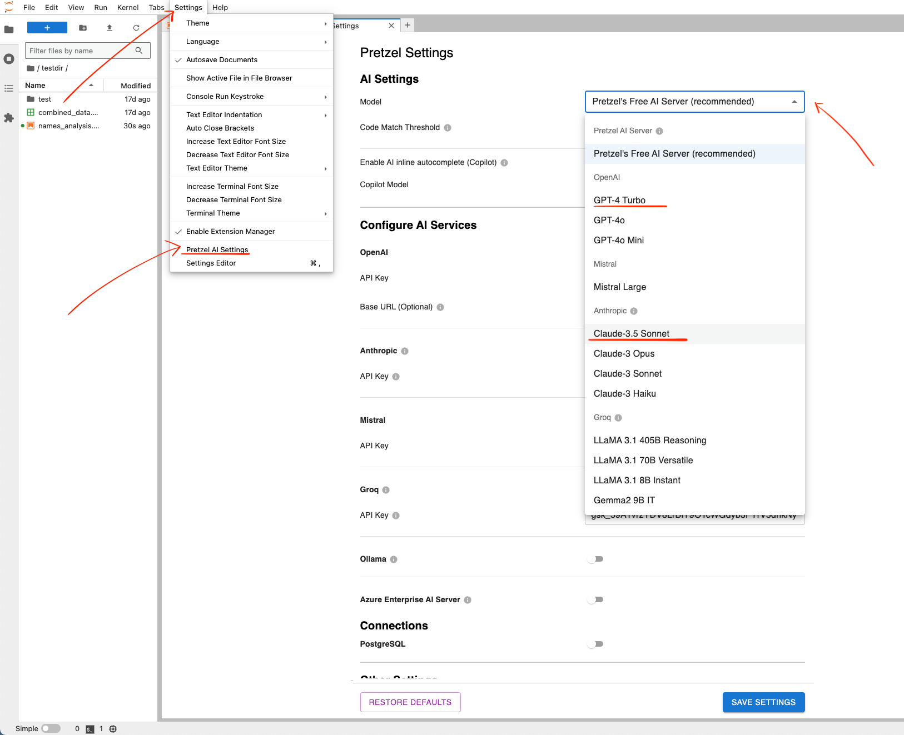

<p align="center">
  <h3 align="center">Pretzel 🥨</h3>

  <p align="center">
    Modern, open-source Jupyter alternative.
    <br />
    <a href="https://pretzelai.app" target="_blank"><strong>Try it here »</strong></a>
    <br />
    <br />
    <a href="https://discord.gg/bYNEgbPzRy" target="_blank">Discord</a>
    ·
    <a href="https://withpretzel.com" target="_blank">Website</a>
    ·
    <a href="https://github.com/pretzelai/pretzelai/issues">Issues</a>
    ·
    <a href="mailto:founders@withpretzel.com" target="_blank">Contact</a>
  </p>
</p>

<p align="center">
   <a href="https://github.com/pretzelai/pretzelai/stargazers" target="_blank"></a>
   <a href="https://pypi.org/project/pretzelai/" target="_blank"></a>
   <a href="https://discord.gg/bYNEgbPzRy" target="_blank"></a>
   <a href="https://github.com/pretzelai/pretzelai/blob/main/LICENSE"></a>
   <a href="https://github.com/pretzelai/pretzelai/pulse"></a>
</p>

https://github.com/pretzelai/pretzelai/assets/121360087/ff4643b1-c931-410e-aa0b-9233e0766223

Pretzel is a fork of Jupyter with the goal to improve Jupyter's capabilities. We've added AI code generation and editing, inline tab completion, sidebar chat and error fixing to Jupyter for now with a lot more to come.

Switching to Pretzel from Jupyter is extremely easy **since it's simply an improved version of Jupyter**. All of your Jupyter config, settings, keybindings, and extensions will work out of the box.

## Quick Start

- Installation: `pip install pretzelai` then run `pretzel lab` to open the web interface. OR, use our **free hosted version**: [pretzelai.app](https://pretzelai.app)
  - See [this](#installation-problems) if you get errors during installation
- Simply start typing in a cell to get inline tab completions
- In any Jupyter cell, click “**Ask AI**” or press Cmd+K (Mac) / Ctrl+K (Linux/Windows) to prompt AI
- Use the **AI Sidebar** with Ctrl+Cmd+B (Mac) or Ctrl+Alt+B (Linux/Windows) to chat with AI, generate code, and ask questions.
- Type `@` to trigger auto-complete with function and variable names.
- To use your own model (OpenAI, Anthropic/Claude, Ollama or Groq), see the [Configuration](#configuration) section


---

Our roadmap includes building features such as:

- Native AI code generation and understanding features similar to [Cursor](https://cursor.sh/)
- Frictionless realtime collaboration: pair-programming, comments, version history, etc.
- SQL support (both in code cells and as a standalone SQL IDE)
- Visual analysis builder (see more [here](https://github.com/pretzelai/pretzelai/tree/main/pretzelai_visual#readme))
- VSCode like code-writing experience using [Monaco](https://github.com/microsoft/monaco-editor)
- 1-click dashboard creation and sharing from Jupyter notebooks

## Installation

### Using pip

Install Pretzel with pip

```
pip install pretzelai
```

For conda, install pip first with `conda install pip` and then `pip install pretzelai`.

Then, start Pretzel with:

```
pretzel lab
```

You'll be able to access the Pretzel interface via the provided URL.

To use your own AI model, see the [Configuration](#configuration) section.

### Running within a docker container

If you're having trouble installing Pretzel (for eg on Windows), you can run it in a Docker container.

1. Create a Dockerfile:

```dockerfile
FROM python:3.9-slim
RUN apt-get update && apt-get install -y \
    build-essential \
    gcc \
    && rm -rf /var/lib/apt/lists/*
WORKDIR /root/pretzel
RUN pip install pretzelai
EXPOSE 8888
CMD ["pretzel", "lab", "--ip=0.0.0.0", "--allow-root", "--notebook-dir=/root/pretzel", "--ServerApp.allow_remote_access=True", "--ServerApp.token=''", "--no-browser"]
```

2. In the same folder where you have your Dockerfile, run `docker build -t pretzel .`

3. To run pretzel, you can run: `docker run --name pretzel -p 8888:8888  pretzel` and once the container is running, you can access it at `http://localhost:8888/lab`. To stop the container, press `Ctrl + C` followed by `docker stop pretzel`.

If you want to access your local folder in Pretzel, you can run: `docker run --rm -p 8888:8888 -v $(pwd):/root/pretzel pretzel` - this will map your current directory to the docker container's `/root/pretzel` folder. Make sure Docker has access to your current directory.

To update Pretzel to the latest version, just rebuild the Docker image with the --no-cache flag: `docker build --no-cache -t pretzel .` and now you can run docker like step 3.

### Bleeding Edge Version

You can use this [Dockerfile](https://github.com/pretzelai/pretzelai/blob/main/Dockerfile) to build and run the bleeding edge version. Follow the steps (starting at step 2) in the section [Running within a docker container](#running-within-a-docker-container)

### Installation problems

If you get an error during installation that looks like this:

```
Failed to build installable wheels for some pyproject.toml based projects (pystemmer)
```

That means the installation failed to install the dependency `PyStemmer`. This usually happens because you don't have the right build tools installed. To fix this:

- **On Windows**: Install Miscrosoft build tools from [here](https://visualstudio.microsoft.com/visual-cpp-build-tools/). Click on the _Download Build Tools_ button and then install it.
- **On Ubuntu (and Debian flavoured systems)**: Install the required build tools by running the following command in your terminal:
  ```
  sudo apt-get update && sudo apt-get install build-essential python3-dev
  ```
- **On macOS**: `brew install gcc`. If this doesn't work, you may also need to run `xcode-select --install`

Once this is done, you should be able to `pip install pretzelai` to install Pretzel.

## Usage

#### Inline Tab Completion

- Start typing in a cell to get inline tab completions
- Wait for 1 second to trigger completions. You'll see a little spinner just before the blue Ask AI button in the cell

The default Pretzel AI Server uses [Mistral's Codestral](https://mistral.ai/news/codestral/) but you can switch the inline completion model in Pretzel AI Settings. See the [configuration](#configuration) section.

#### Generating and editing code in notebook cells

- In a cell, press **`Cmd+K` (Mac) / `Ctrl+K` (Windows/Linux)** or **click "Ask AI"** to open AI prompt textbox and write your code generation/editing instruction
  - Type `@` to get a dropdown of available variables in your session. Adding this `@vairable` to the prompt will send its value to the AI
  - We automatically send relevant code in the current notebook as context to the AI
- If there's existing code in a cell, the prompt will edit the existing code
  - If you select/highlight some code in the cell, only the selected code will be edited
- You can accept/reject the response or edit your prompt if you want to re-submit with modifications
- Use ↑ / ↓ to cycle through prompt history

#### Using the AI Sidebar

- Use **`Ctrl+Cmd+B` (Mac) / `Ctrl+Alt+B` (Linux/Windows)** or the [Pretzel Icon on the right sidebar](assets/pretzel-icon-finder.png) to activate the AI Sidebar
- You can ask questions, generate code, or search for existing code
- The AI always **uses the code in the active cell as context**. If you highlight some code in the active cell, only the highlighted code will be used as context
- We automatically send relevant code in the current notebook as context to the AI
- You can also use the `@` syntax to refer to variables and dataframes in memory, similar to the notebook cells

_Example uses of AI Sidebar_:

- "Modify the function `my_function` to be more efficient" ← _this will find the function `my_function` in the whole notebook and modify it_
- "Where is the code that removes outliers"? ← _this will search the notebook for code that removes outliers and show it to you_
- _(While cursor is in a cell with some code)_ "Can you explain what this code does?" ← _this will explain the code **in the current cell**_
- "Plot a histogram of @df for age" ← _this will generate code to plot a histogram of the 'age' column from the dataframe named 'df'_
- "Calculate the mean revenue in @sales*data for each product type" ← \_this will generate code to calculate mean revenue by product type using the `sales_data` dataframe*

#### Adding code in the middle of existing code

- Put your cursor either on an empty line or an existing line of code. Bring up the AI prompting text box with Cmd+K
- Start your prompt with the word `inject` or `ij` (case-insensitive) - this tells the AI to only add new code and not edit the existing code in the cell
- **Code will be added one line below** where your cursor was placed

#### Fix errors with AI

- When there's an error, you'll see a button on top-right "**Fix Error with AI**". Click it try fixing the error

## Configuration

**Pretzel works out-of-the-box, no configuration needed.** We **DO NOT** store any code or data you send to the Pretzel AI Server.

Still, if you want to use a different AI model, you can configure Pretzel to **use AI models from multiple different vendors, including local models.** In this case, the AI request goes directly from your computer to the AI service (OpenAI, Anthropic etc).

- Open the `Settings` menu in the top menubar, then click `Pretzel AI Settings`
- Under **AI Settings** you can pick which AI models to use for chat and for inline completion (see screenshot below)
  - We recommend using GPT-4 class models (e.g., GPT-4 Turbo, GPT-4o, Claude-3.5 Sonnet, Claude-3 Opus and Llama-3.1 405B) for the best performance

Under the section **Configure AI Services**, you can

- Enable or disable certain AI services (for eg, Azure and Ollama are disabled by default but can be enabled)
- Enter your API key or URL as needed for each service

Remember to save your settings after making changes. Pretzel will validate your configuration to ensure everything is set up correctly.



Please note: We haven't tested _Azure Enterprise OpenAI_ models yet. If you find any bugs, please report them in [GitHub issues](https://github.com/pretzelai/pretzelai/issues) and we'll fix them ASAP.

## Feedback, bugs and docs

- Please report bugs here: https://github.com/pretzelai/pretzelai/issues
- Have any feedback? Any complains? We'd love feedback: founders@withpretzel.com

## Jupyter specific information

The original Jupyter documentation is available [here](https://jupyter.org/) and
the Jupyterlab README is available [here](https://github.com/jupyterlab/jupyterlab).

## Privacy Policy, Data Collection and Retention

We collect no personal information. We use basic telemetry for only the AI features we've built - for example, when you click on "Ask AI", we receive an event that _someone_ clicked on "Ask AI". We only associate an anonymous ID to your user. If you allow cookies, that helps us tell that it's the same user across multiple browser sessions (which is very helpful!). If you don't allow cookies, every time you open a browser, you're a new anonymous user to us.

We also collect prompts (**but not the responses**) for the AI features we've built. This can be turned off in the settings (Settings > Pretzel AI > Uncheck Prompt Telemetry) but we'd really appreciate if you didn't - this is very helpful in improving our prompts.

We do not collect any code whatsoever. Even when you use Pretzel's cloud AI server for completions, we don't store any of this code.

If you use the hosted version of Pretzel (https://pretzelai.app), we create a user for you based on your email address. You can always simply log-in and delete any data you may have stored on our hosted server. We make no backups or copies of your data.

Our hosted server is free to use. However, we will delete your data and your account 30 days after your last login. If you'd like to delete your account sooner, please email us at founders@withpretzel.com with the subject line "Account Deletion" and we'll delete your account immediately.

## FAQ

**Q.** _What happened to the old version of Pretzel AI - the visual, in-browser data manipulation tool?_

**A.** It's available in the [`pretzelai_visual` folder here](https://github.com/pretzelai/pretzelai/tree/main/pretzelai_visual). Please see [this PR](https://github.com/pretzelai/pretzelai/pull/76) for more info.

**Q.** _What AI model does Pretzel use?_

**A.** Pretzel uses different AI models for various tasks:

1. Default model: GPT-4o

   - Offers a good balance between speed and quality
   - Can be changed in Pretzel Settings if you're using your own API key

2. Inline completions: [Mistral's Codestral model](https://mistral.ai/news/codestral/)

   - Excellent for code completion
   - Very fast performance (22B parameter model)

3. Fallback option:
   - If you're using your own API key without providing a Mistral API Key, Pretzel will use GPT-4o for inline completions as well

We're continuing to experiment with models and supporting local models and Anthropic's Claude is at the top of our list.

**Q.** _What about feature X?_

**A.** There's a ton we want to build. Please [open an issue](https://github.com/pretzelai/pretzelai/issues) and tell us what you want us to build!

**Q.** _Where's the roadmap?_

**A.** We have a rough roadmap at the top of this README. There are many features we'd like to build, but there's just two of us. So, we're collecting feedback about what would be most helpful. Please open an issue or just email us with your feedback! Based on what we find, we'll prioritize our roadmap.

**Q.** _Why are you using the AGPL license? Or, why not use MIT/BSD3 licenses?_

**A.** Our goal with building Pretzel is to make an amazing data tool that is free for both individuals and companies to use. That said, we are a two-person startup - and we don't want some third party to just take our code and sell a hosted version of it without giving back to the community. Jupyter code is licensed as BSD-3 and if we keep our new code BSD-3 licensed, there would be no way to stop a third party from doing this. As a result, we went with the AGPLv3 license for all the new code. This ensures that if someone else does want to take our code and sell it (SaaS or otherwise), they have to open-source all of their modifications under AGPLv3 as well.

**Q.** _Why a fork of Jupyter? Why not contribute into Jupyter directly?_

**A.** This deserves a longer answer but here's the short answer: We've set out to make the **new** de-facto, modern, open-source data tool. Initially, we wanted to start from scratch. However, after talking to several data professionals, we realized it will be very hard to get people to switch to a new tool, no matter how good. The best way to get people to switch is to not have them switch at all. That's why we decided to fork Jupyter - for the near zero switching costs. Also, Jupyter is a mature product, and we're shipping feature really fast - frankly, at the pace we're shipping features, the code we write won't be accepted into the Jupyter codebase 😅. There are also many downsides to this decision - we've had to spend considerable time understanding the whole Jupyter ecosystem and multiple codebases, the complex release processes, the various APIs etc. However, we think this is the right decision for us.

**Q.** _My company is worried about using an AGPLv3 licensed tool. What can I do?_

**A.** The AGPL is a barrier ONLY IF you're modifying Pretzel AND redistributing it to the public. If you're simply using it as a tool in your company (even with modifications), the AGPL DOES NOT ask you to share your code. Still, if AGPL is an issue for you, please contact us, and we can figure out something that works.

**Q.** _How are you planning on making money? OR, how are you free? I'm worried that you'll make this tool paid in the future._

**A.** We're planning on selling a hosted version of the tool to companies to make money. This hosted version will probably have some company specific features that individuals don't want or need such as data access controls, connectors for data sources, integration with GitHub, hosted and shareable dashboard, scalable and on-demand compute for large data jobs etc. We will not retroactively make Pretzel's individual version paid.
