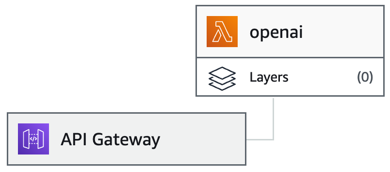

## AWS Lambda deployment instructions

- Create a Lambda function in AWS connected to API Gateway
- Increase the timeout to 20 seconds in the function
- Configure CORS in API Gateway
- Copy the code of `aws_lambda.js` to your function code and modify with your API key
- Click "Deploy"
- Update AI_ENPOINT variable in `src/lib/config.ts`
